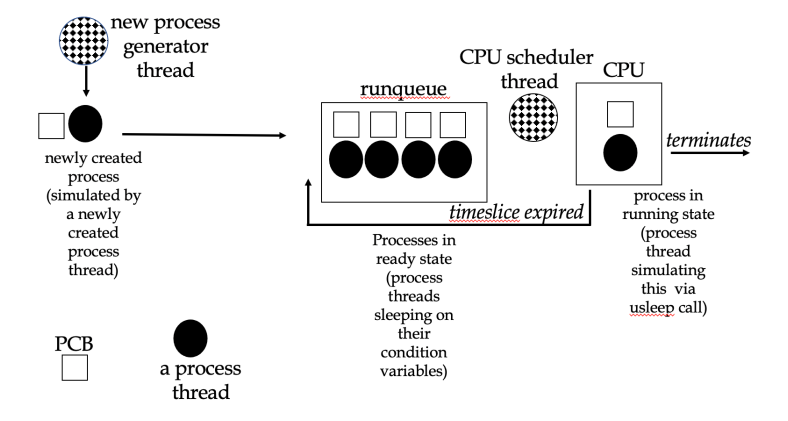
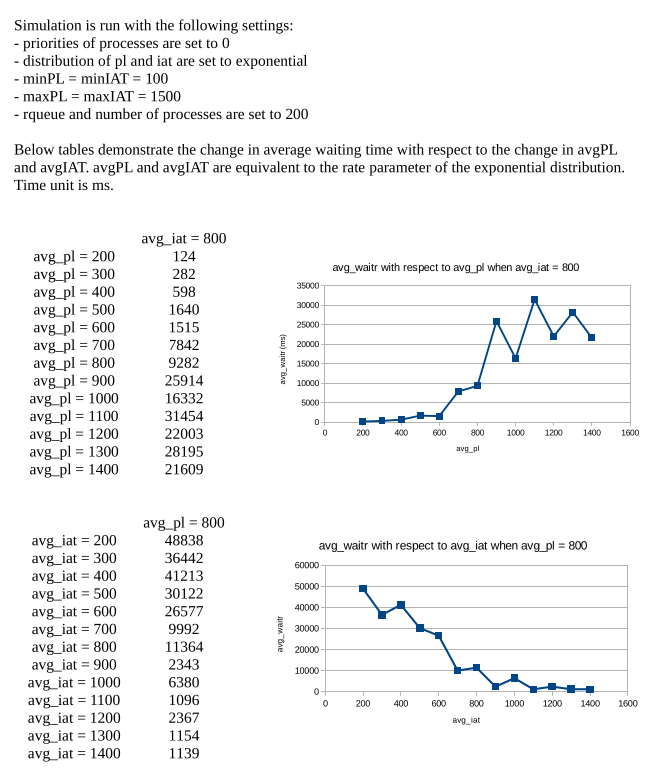

```$ cfs C minPrio maxPrio distPL avgPL minPL maxPL distIAT avgIAT minIAT maxIAT rqLen ALLP OUTMODE [OUTFILE]```

#### Program Description
This is a multi-threaded program, called cfs, that simulates processes and their scheduling in a system. The scheduling algorithm is CFS (completely fair scheduler). The simulated system has one CPU and one runqueue. Each process has a single cpu burst, which is also the length of the process (i.e., required cpu time). Processes are simulated with threads.Each process thread has its own condition variable to sleep on, while it is waiting in the runqueue for CPU to be assigned. Besides the process threads simulating processes, there are two control threads: a generator thread and a scheduler thread. The generator thread creates process threads. Before creating a process thread, it waits for some amount of time (interarrival time) using usleep() function. Then it creates a process thread by using pthread_create() function. It repeats this behavior until desired number of process threads are created. The scheduler thread schedules the process threads for CPU. It also has an associated condition variable, and when not scheduling, it sleeps on its condition variable. When woken up, the scheduler thread checks if scheduling is needed. If not needed, it goes to sleep again. Otherwise, it selects a process thread from the runqueue according to CFS algorithm. Then it wakes up the selected thread by signaling on its condition variable. After scheduling a process thread, the scheduler thread sleeps again. The scheduler thread is woken up in the following cases: 1. when the running process thread terminates and leaves the CPU. 2. when the timeslice for the running process thread expires and it gets added to the runqueue again. 3. when a new process thread is created and added to the runqueue. Each process thread has a C structure allocated (PCB). It keeps information about a process thread, like its pid, state, corresponding thread id, process length, total time spent in the CPU, a condition variable to sleep on, etc. After being created, a process thread adds itself (its PCB) to the runqueue and starts sleeping on its condition variable until it is selected for CPU. Before sleeping, it signals the scheduler thread. Note that while accessing the runqueue, or any other shared data, related locks are acquired so that no race conditions will happen. When selected for CPU, a process thread is woken up by the scheduler thread. The woken up thread removes itself (its PCB) from the runqueue and starts using the CPU. Before using the CPU, it first calculates its timeslice and its remaining time to finish. Let x be the minimum of these two values. Then, running in CPU for x ms is simulated by calling the usleep() function and sleeping for x ms. When the process leaves the CPU, i.e., the process thread returns from usleep(), it updates its virtual runtime. If its remaining CPU time for the process did not become zero, it adds itself to the runqueue and start sleeping on its condition variable again. Otherwise, it terminates. Before termination, a process thread deallocates its resources and destroys its synchronization variables (for example, its condition variable). After leaving the CPU, a process thread signals the scheduler thread.



#### Results

